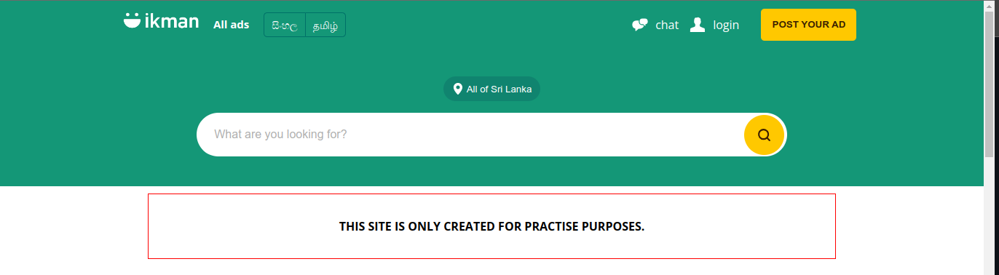
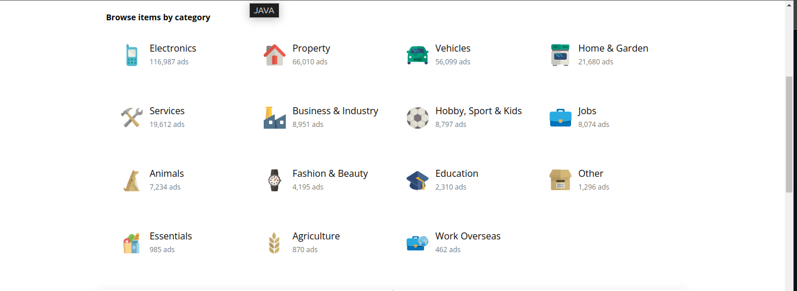
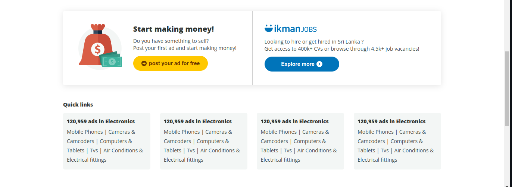
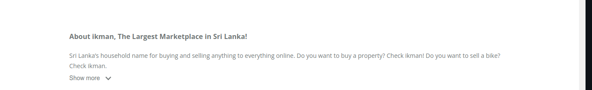
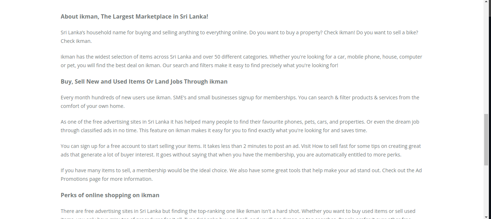
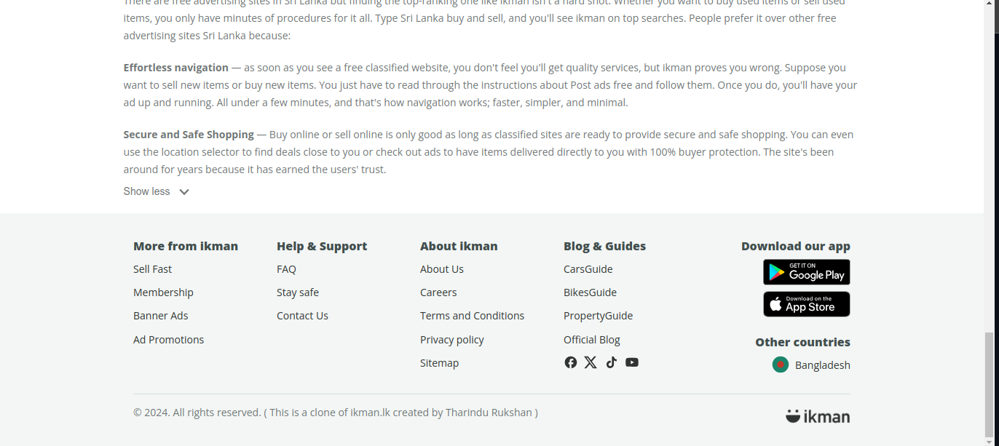

# ikman.lk Clone


This project is a responsive clone of the ikman.lk homepage, built using HTML and CSS. It aims to provide a user experience similar to the original ikman.lk website while being accessible on various devices and screen sizes. This project is created by Ravindya Jayasooriya for experimental purposes.

**Note:** This is not an official product and is not intended for public use.

## Features
-  **Responsive Design:** Works on various devices and screen sizes.
-  **Accurate Clone:** Mimics the layout and styling of the ikman.lk homepage.
-  **Clean Code:** Well-organized for easy maintenance and updates.

## Technologies Used
-  **HTML:** For the structure of the web pages.
-  **CSS:** For styling and responsive design.
-  **ECMAScript:** For scripting and interactivity.
-  **IntelliJ IDEA:** As the integrated development environment (IDE) for coding and project management.

## Visit the Site
You can visit the live version of this project by clicking the link below:
[Live Version](#)

## Screenshots








## Getting Started

### Prerequisites
-  

### Installation
Clone this repository using the following command:

```bash 
git clone https://github.com/Rukshan1999/ikman.lk-clone.git
```
## Disclaimer


This is a work in progress exploring web development concepts and functionalities. While it's not a perfect replica of the ikman.lk website, the code provides a foundation for learning and experimentation.

Feel free to modify, add features, and dive into different technologies!

## Version
1.0.0

## License
This project is distributed under the [MIT License](LICENSE.txt). See the LICENSE file for details.

## Contact
For any questions or suggestions, please contact:
Tharindu Rukshan: [tharindurukshan709@gmail.com](tharindurukshan709@gmail.com)

© 2024 Tharindu Rukshan. All rights reserved.